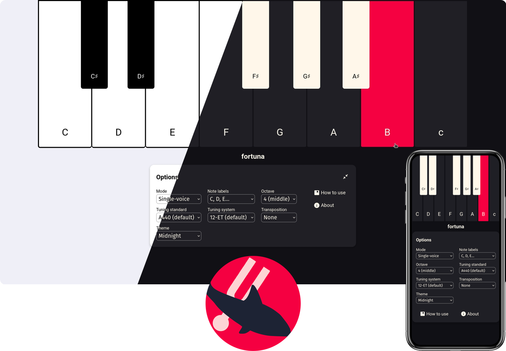

# fortuna

Straightforward open-source drone tuner.

[Try it out live!](https://purewave0.github.io/fortuna)

- Easy to use
- Customisable
- Responsive
- Keyboard-friendly
- Includes a quick how-to-use guide
- Saves your preferences locally

## Options

- Single-voice and two-voice mode
- Note labels (none, C-B, Do-Si, Do-Ti)
- 7 available octaves
- Tuning standards: A440, A432, A441…
- Tuning systems: 12 Equal Temperament, Just Intonation
- Transposition
- Themes: light, dark, midnight

## Credits

- [Wikipedia](https://en.wikipedia.org/) for information on Tuning Standards and Tuning Systems
- [Google's Material Symbols](https://fonts.google.com/icons) for the SVG icons
- [MicroModal](https://micromodal.vercel.app/) for the modals
